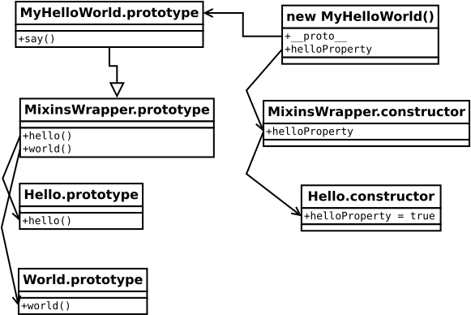

# UML

### Typical mixins implementation diagram



``` javascript
class Hello {
    constructor () {
        this.helloProperty = true;
    }
    hello() {
        return 'Hello';
    }
}

class World {
    world() {
        return 'World';
    }
}

class MyHelloWorld extends mixiner.mix(Hello, World) {
    say() {
        if (this.helloProperty) {
            return `${this.hello()} ${this.world()}`;
        }
    }
}

const myHelloWorld = new MyHelloWorld();
myHelloWorld.say(); // 'Hello World'
```
